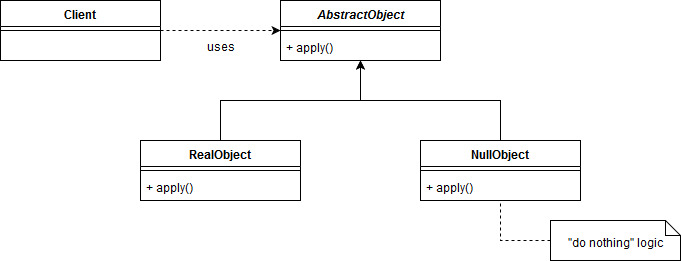

#UML

we can identify the following participants:

Client requires an instance of AbstractObject
AbstractObject defines the contract Client expects – it may also contain shared logic for the implementing classes
RealObject implements AbstractObject and provides real behavior
NullObject implements AbstractObject and provides neutral behavior